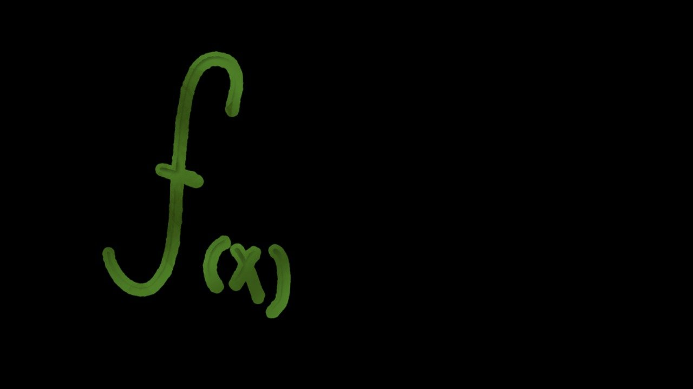

# go-lambda

[](https://codecov.io/gh/chyroc/go-lambda)
[](https://goreportcard.com/report/github.com/chyroc/go-lambda)
[](https://github.com/chyroc/go-lambda/actions)
[](https://opensource.org/licenses/Apache-2.0)
[](https://pkg.go.dev/github.com/chyroc/go-lambda)
[](https://badge.fury.io/go/github.com%2Fchyroc%2Fgo-lambda)



Process data like functional programming

## Install

```shell
go get github.com/chyroc/go-lambda
```

## Usage

### New

```go
func ExampleNew() {
	// new with string list
	lambda.New([]string{"1", "2"})

	// new with struct
	lambda.New([]exampleItem{{Name: "Tom"}, {Name: "Harry"}})
}
```

### Chunk

```go
func ExampleObject_Chunk() {
	// Split the list into shorter length lists
	res, err := lambda.New([]int{1, 2, 3, 4, 5}).Chunk(2).ToIntListList()
	fmt.Println("err:", err)
	fmt.Println("res:", res)
	// output:
	// err: <nil>
	// res: [[1 2] [3 4] [5]]
}
```

### Compact

```go
func ExampleObject_Compact() {
	// Remove 0-valued elements from the list
	res, err := lambda.New([]int{0, 1, 2, 1, 0, 2}).Compact().ToIntSlice()
	fmt.Println("err:", err)
	fmt.Println("res:", res)
	// output:
	// err: <nil>
	// res: [1 2 1 2]
}
```

### Flatten

```go
func ExampleObject_Flatten() {
	// Flatten the list
	res, err := lambda.New([][]int{{1, 2}, {2, 3}, {4}}).Flatten().ToIntSlice()
	fmt.Println("err:", err)
	fmt.Println("res:", res)
	// output:
	// err: <nil>
	// res: [1 2 2 3 4]
}
```

### Reverse

```go
func ExampleObject_Reverse() {
	// Reverse list
	res, err := lambda.New([]int{1, 2, 3, 4}).Reverse().ToIntSlice()
	fmt.Println("err:", err)
	fmt.Println("res:", res)
	// output:
	// err: <nil>
	// res: [4 3 2 1]
}
```

### Uniq

```go
func ExampleObject_Uniq() {
	// Remove duplicate elements in the list
	res, err := lambda.New([]int{1, 2, 1, 3, 2, 3, 4}).Uniq().ToIntSlice()
	fmt.Println("err:", err)
	fmt.Println("res:", res)
	// output:
	// err: <nil>
	// res: [1 2 3 4]
}
```

### MapArray

```go
func ExampleObject_MapList() {
	// Traverse the elements of the list, and after each element is processed, the returned elements form a new list
	res, err := lambda.New([]int{1, 2, 3}).MapArray(func(idx int, obj interface{}) interface{} {
		return obj.(int) + 1
	}).ToIntSlice()
	fmt.Println("err:", err)
	fmt.Println("res:", res)
	// output:
	// err: <nil>
	// res: [2 3 4]
}
```

### FilterArray

```go
func ExampleObject_FilterList() {
	// Traverse the elements of the list, each element is added to a new list or not, and a new list is returned
	res, err := lambda.New([]int{1, 2, 3, 4}).FilterArray(func(idx int, obj interface{}) bool {
		return obj.(int)%2 == 0
	}).ToIntSlice()
	fmt.Println("err:", err)
	fmt.Println("res:", res)
	// output:
	// err: <nil>
	// res: [2 4]
}
```